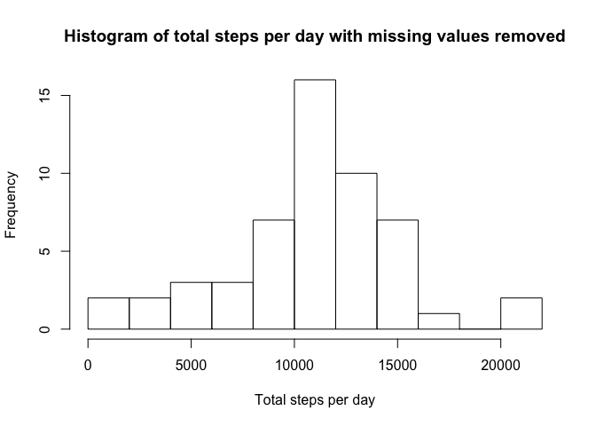
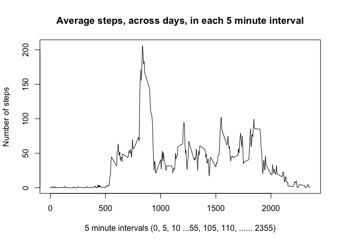
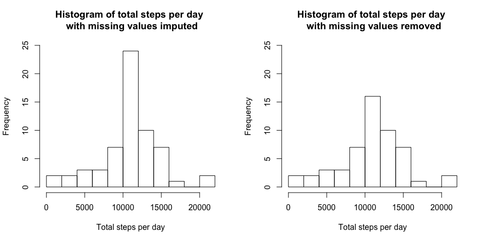
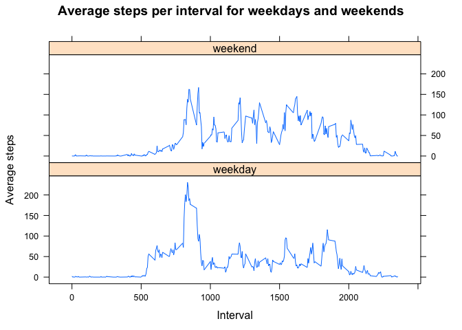

# Reproducible Research: Peer Assessment 1

```r
library(knitr)
library(dplyr)
library(lattice)
```


```r
opts_chunk$set(echo=TRUE)
```

## 1. Loading and preprocessing the data

```r
# Read the data from file
activityData <- read.csv(unz("./activity.zip", "activity.csv")) 
```


```r
# the dimensions of the data loaded
d <- dim(activityData) 
#names of columns
columns <- names(activityData) 
```

- The data read contains **17568 observations** in 3 columns. The columns names are:   
**steps, date, interval**

The details of the variables included in this dataset are:  
- **steps**: Number of steps taking in a 5-minute interval  
- **date**: The date on which the measurement was taken in YYYY-MM-DD format  
- **interval**: Identifier for the 5-minute interval in which measurement was taken  

The first few rows of the data:

```r
head(activityData)
```

```
##   steps       date interval
## 1    NA 2012-10-01        0
## 2    NA 2012-10-01        5
## 3    NA 2012-10-01       10
## 4    NA 2012-10-01       15
## 5    NA 2012-10-01       20
## 6    NA 2012-10-01       25
```

Transoformation and summarisation of data to simplify later computation and graph building   
- Convert the 'date' values from character to 'Date' objects  
- Compute the total steps per day    
- Compute the average steps per interval across the days  


```r
#Convert the values in 'date' column to 'Date' objects
activityData <- mutate(activityData, date=as.Date(date)) 
#Work out the total steps per day with cases with missing values removed
totalStepsPerDay <- summarise(group_by(activityData[complete.cases(activityData),], 
                                       date) , totalSteps=sum(steps, na.rm=TRUE)) 
#Compute the average steps in each interval with cases with missing values removed
avgStepsPerInterval <- summarise(group_by(activityData[complete.cases(activityData),], 
                                          interval) , avgSteps=mean(steps, na.rm=TRUE)) 
```

## 2. What is mean total number of steps taken per day?
Visualisation of the data (with missing values removed) using a histogram  

```r
#Plot the histogram of total steps per day
hist(totalStepsPerDay$totalSteps, breaks=10, xlab="Total steps per day",   
     main="Histogram of total steps per day with missing values removed") 
```

 

Computing the mean and median of the total steps per day with missing values removed

```r
# Average of total steps per day
avg <- mean(totalStepsPerDay$totalSteps) 
# Median of total steps per day
med <- median(totalStepsPerDay$totalSteps) 
# Number of decimal points to display
decPoints <- 2
```

- The mean of total number of steps taken per day, with missing values removed, is **10766.19**  

- The median of total number of steps taken per day, with missing values removed, is **10765**  

## 3. What is the average daily activity pattern?
Plotting average, across days, of the steps taken in each 5 minute interval  


```r
plot(avgStepsPerInterval$interval, avgStepsPerInterval$avgSteps, type="l", 
     main="Average steps, across days, in each 5 minute interval", 
     xlab="5 minute intervals (0, 5, 10 ...55, 105, 110, ...... 2355)", 
     ylab="Number of steps")
```

 

Which interval had the maximum number of steps?  

```r
maxStepInterval <- (avgStepsPerInterval[avgStepsPerInterval$avgSteps==
                                               max(avgStepsPerInterval$avgSteps),])[,1]
maxStepIntervalVal <- (avgStepsPerInterval[avgStepsPerInterval$avgSteps==
                                               max(avgStepsPerInterval$avgSteps),])[,2]
```

- The maximum number of steps, on average across the days, occured at the 5 minute interval starting **835** with a value of **206.17**

## 4. Imputing missing values
There are a number of days/intervals where values for 'steps' are missing (values coded as NA ). The presence of missing days may introduce bias into some calculations or summaries of the data.  


```r
missingValCount <- colSums(is.na(activityData)) #Work out the count of missing values
```
The missing value count in each of the 3 columns are:   
- 2304, 0, 0.

Filling in the missing values with appropriate values (imputing) can help in analysing and understanding the data better.  

For the remaining part of this report the missing values are filled in using the average number of steps for the same interval across all days.  


```r
impActivityData <- merge(activityData, avgStepsPerInterval, by.x = 3, by.y = 1, all.x = TRUE)
impActivityData = transform(impActivityData, steps = ifelse(is.na(steps), avgSteps, steps))
```
 
Computing the total steps per day with the imputed data.  

```r
#Compute the total steps per day
ImpTotalStepsPerDay <- summarise(group_by(impActivityData, date), 
                                 totalSteps=sum(steps, na.rm=TRUE)) 
```

Visualisation of the data, with missing values imputed and with missing values removed (from earlier section), using histogram.  


```r
par(mfrow=c(1,2))
yLim <- c(0, 25)
#Plot the histogram of total steps per day with missing values imputed
hist(ImpTotalStepsPerDay$totalSteps, breaks=10, 
     xlab="Total steps per day", 
     main="Histogram of total steps per day \n with missing values imputed",
     ylim=yLim)
#Plot the histogram of total steps per day with missing values removed
hist(totalStepsPerDay$totalSteps, breaks=10, 
     xlab="Total steps per day",   
     main="Histogram of total steps per day \n with missing values removed",
     ylim=yLim) 
```

 

Computing the mean and median of the total steps per day with missing values imputed.  

```r
avgImp <- mean(ImpTotalStepsPerDay$totalSteps) # Average of total steps per day
medImp <- median(ImpTotalStepsPerDay$totalSteps) #Median of total steps per day
```

The mean of total number of steps taken per day:  
- with missing values imputed - **10766.19**  
- with missing values removed - **10766.19**  
- difference between the two - **0.00**   


The median of total number of steps taken per day:  
- with missing values imputed - **10766.19**  
- with missing values removed - **10765**  
- difference between the two - **1.19**   

## 5. Are there differences in activity patterns between weekdays and weekends?

```r
#Create a factor variable to identify the date as weekend of weekday
impActivityData$weekDay <- as.factor(ifelse(weekdays(impActivityData$date) 
                                            %in% c("Sunday","Saturday"), "weekend", "weekday"))
#Work out the average steps per interval for weekdays and weekends seprately
avgStepsPerIntervalWday <- summarise(group_by(impActivityData, weekDay, 
                                              interval), avgSteps=mean(steps, na.rm=TRUE)) 
```

- Plot of average steps per interval for weekdays and weekends with data imputed for missing values show the difference between activity on weekdays and weekends.  


```r
#Plot average steps per interval for weekdays and weekends
xyplot(avgSteps~interval | weekDay, data=avgStepsPerIntervalWday, layout=c(1,2), type="l", 
       main="Average steps per interval for weekdays and weekends",
       ylab="Average steps", xlab="Interval")
```

 
